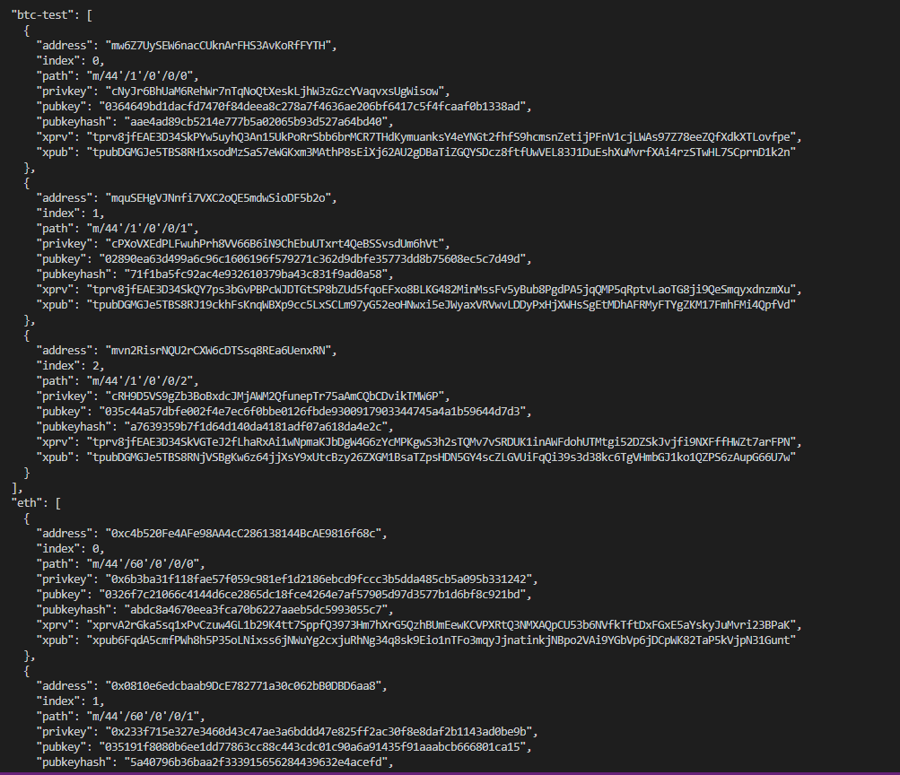
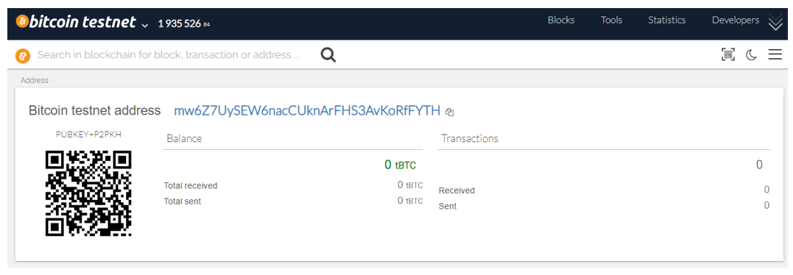
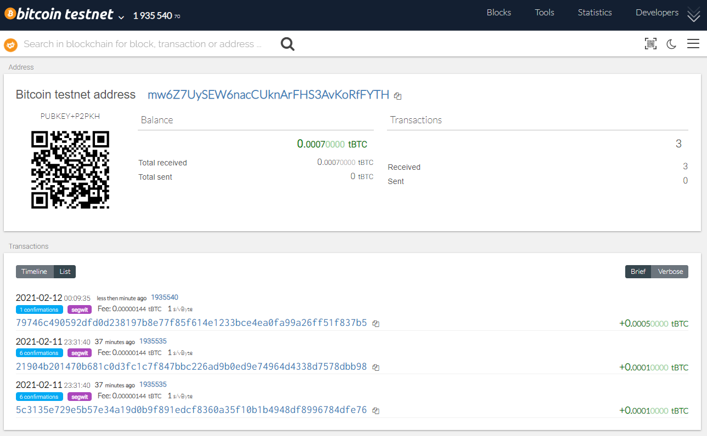
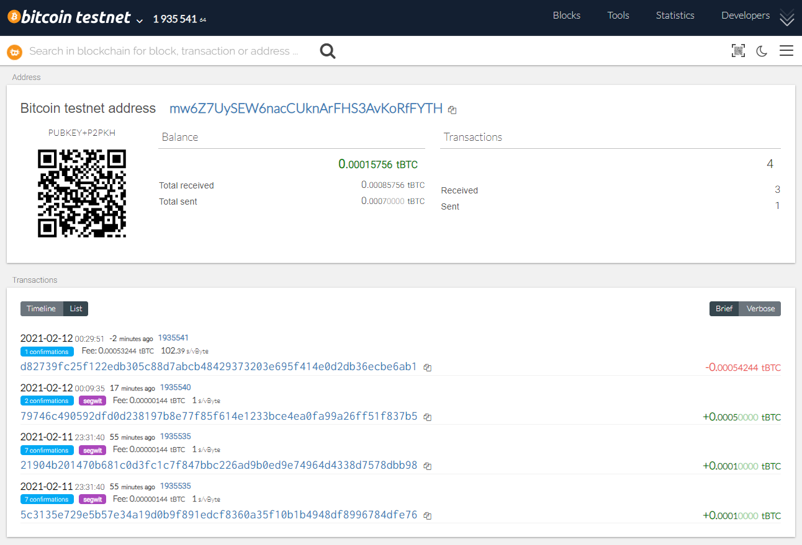
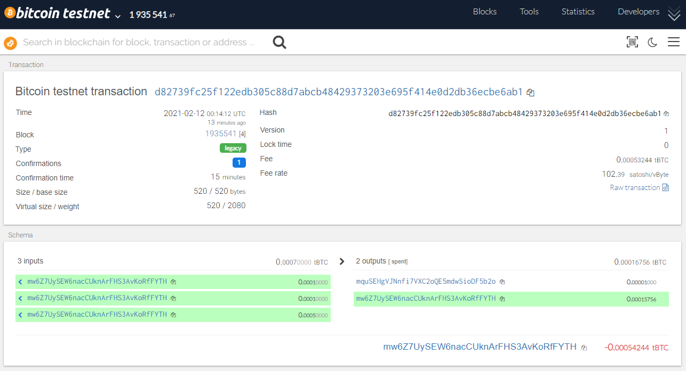
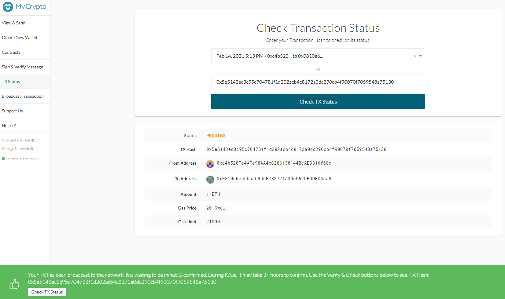

# Multi-Blockchain Wallet in Python

## Installing Dependencies

* Anaconda (including terminal window) (https://docs.anaconda.com/anaconda/install/)
    * python library: **web3** (using terminal window to enter command: pip install web3)
    * python library: **bit** (using terminal window to enter command: pip install bit)

* XAMPP (includes the PHP environment and dependencies)  (https://www.apachefriends.org/index.html)
    * Clone and install hd-wallet-derive repo (https://github.com/dan-da/hd-wallet-derive#installation-and-running), using terminal window, enter the following command: 
    git clone https://github.com/dan-da/hd-wallet-derive 
	cd hd-wallet-derive 
	php -r "readfile('https://getcomposer.org/installer');" | php 
	php composer.phar install

    Confirm installation by running the following command line: 
    ./hd-wallet-derive.php -g --key=xprv9tyUQV64JT5qs3RSTJkXCWKMyUgoQp7F3hA1xzG6ZGu6u6Q9VMNjGr67Lctvy5P8oyaYAL9CAWrUE9i6GoNMKUga5biW6Hx4tws2six3b9c --numderive=3 --preset=bitcoincore --cols=path,address --path-change

* Geth & Tools (https://geth.ethereum.org/downloads/)

* MyCrypto (https://download.mycrypto.com/)

 

### **hd-wallet-derive**  
The **hd-wallet-derive** is a command-line tool that derives BIP32 addresses and private keys for Bitcoin (BTC) using the PHP language.  The hd-wallet-derive was used to send transactions for Bitcoin using Bitcoin testnet.  The hd-wallet-derive uses BIP39 seed words (mnemonic), coin symbol (BTCTEST, ETH, BTC) and number of keys to derive to return a list of columns that include: public addresses, private keys, hash of the public key, BIP32 path to derive, index to derive keys from, xprv to derive child private keys, and xpub that allows for a full view of the transactions, addresses, and balances. 

 

### **Deriving wallet keys**
A mnemonic was generated using Mnemonic Code Converter (https://iancoleman.io/bip39/) and called using the hd-wallet-derive.  The output was formatted as JSON by importing the json library and parsed using json.loads(output).  The ojbect `coin` was created to derive `ETH` and `BTCTEST` using the following lines of code:
 

    def derive_wallets(mnemonic, coin, numderive):
        command = f'php ./hd-wallet-derive/hd-wallet-derive.php -g --mnemonic="{mnemonic}" --coin="{coin}" --numderive="{numderive}" --cols=address,index,path,privkey,pubkey,pubkeyhash,xprv,xpub --format=json'

        p = subprocess.Popen(command, stdout=subprocess.PIPE, shell=True)
        output, err = p.communicate()
        p_status = p.wait()
        #print(output)

        keys = json.loads(output)
        return keys

    numderive = 3
    coin = {"btc-test": derive_wallets(mnemonic, BTCTEST, numderive), "eth": derive_wallets(mnemonic, ETH, numderive)}
    print(json.dumps(coin, indent=2, sort_keys=True))

**Output:**
    

 

### **Linking the transaction and signing libraries**  
The libraries `bit` and `web3` were used to convert the private key string to a wallet import format (wif) that is used by Bitcoin.  A transaction was created, signed and used to send a test transaction.  The wallet was funded using testnet faucets:  The `BTCTEST` address `mw6Z7UySEW6nacCUknArFHS3AvKoRfFYTH` funded using (https://tbtc.bitaps.com/).

 

**Pre-Funded BTCTEST:**

 

**Funded BTCTEST:**

 

The `BTCTEST` address `mw6Z7UySEW6nacCUknArFHS3AvKoRfFYTH` funded using the following lines of code: 
btc_key = coin[BTCTEST][0]['privkey'] 
btc_address = coin[BTCTEST][1]['address'] 
send_tx(BTCTEST, priv_key_to_account(BTCTEST, btc_key),btc_address, 0.00000)
 

 

**Confirmation of Funded BTCTEST:**

 

 

## Local PoA ethereum transaction
* `ETH` address and balance added to the `puppernet.json`:  `0xc4b520Fe4AFe98AA4cC286138144BcAE9816f68c` 
 
* Open a Terminal window and navigate to the designated folder directory 

    * Initialize the first node using the genesis .json file by running the command:  `./geth --datadir node1 init puppernet.json`

    * Unlock the account and enable mining using the RPC flag by running the command:  `./geth --datadir node1 --unlock "d84d79a0069fb5d3cf8eca3c689f231d6b603c8f" --mine --rpc --allow-insecure-unlock`

    * Initialize the second node using the genesis .json file by running the command:  `./geth --datadir node2 init puppernet.json`, unlock the account and enable mining using the first node's **enode** address as the bootnode flag by running the command: 

        `./geth --datadir node2 --unlock "7a4f862ab163fc62dce2cfbb734ddac153c5e8cc" --mine --port 30304 --bootnodes "enode://8616f282b378970c7f24bb1817bc8fb7577d484ce68de37ec05f1bf80553882749d171b2103f63cff81911b27f88ca99a6acf30dda47985b7c9a416d0ffdfc58@127.0.0.1:30303" --ipcdisable --allow-insecure-unlock`

### Sending Test Transaction using MyCrypto

* MyCrypto GUI wallet used to connect to the first node (node1) that includes the RPC port

* Keystore node imported from the `node1/keystore` directory into MyCrypto (password `testnetpassword`)

* Blockchain successfully created and test transactions sent from the funded `ETH` account that was added to the `puppernet.json` to another `ETH` account

* The `ETH` pre-funded address `0xc4b520Fe4AFe98AA4cC286138144BcAE9816f68c` was used to send a transaction to another `ETH` address under the child account [1] `0x0810e6edcbaab9DcE782771a30c062bB0DBD6aa8` and the following lines of code can be used to send the transaction outside of MyCrypto: 
eth_key = coin[ETH][0]['privkey'] 
eth_address = coin[ETH][1]['address'] 
send_tx(ETH, priv_key_to_account(ETH, eth_key),eth_address, 0.00001)

**Transaction Sent**  
TX Hash: 0x5e5143ec3c95c704781f1d202acb4c8172a0dc290cb4f90070f7059548a75130
